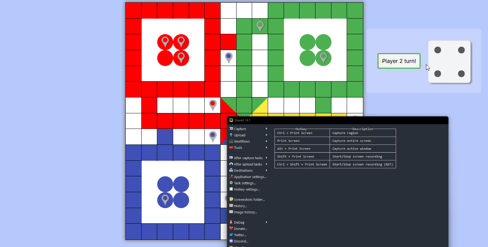

# ludo-js

Ludo board game made with in Javascript. I`m developing this game with React to improve my front-end skills and exploring better data structures, state management without any library.

Board preview:

In game preview:

